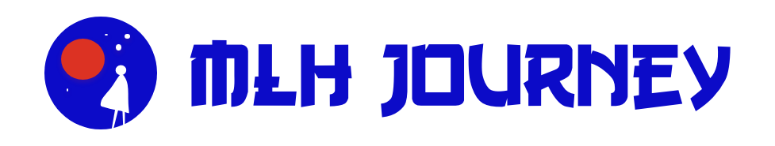

<!-- PROJECT LOGO -->
<br />
<p align="center">
  <a href="https://github.com/othneildrew/Best-README-Template">
    
  </a>

<!-- TABLE OF CONTENTS -->
<details open="open">
  <summary>Table of Contents</summary>
  <ol>
    <li>
      <a href="#about-the-project">About The Project</a>
      <ul>
        <li><a href="#built-with">Built With</a></li>
      </ul>
    </li>
    <li>
      <a href="#getting-started">Getting Started</a>
      <ul>
        <li><a href="#installation">Installation</a></li>
      </ul>
    </li>
    <li><a href="#contributing">Contributing</a></li>
    <li><a href="#license">License</a></li>
    <li><a href="#contributors">Contributors</a></li>
    <li><a href="#acknowledgements">Acknowledgements</a></li>
  </ol>
</details>


<!-- ABOUT THE PROJECT -->
# About The Project ✨🗺️ 

This project helps fellows to track their journey so far in the fellowship. We leverage on personalized GitHub data that is fetched when a fellow logins in using GitHub authentication. The project will help fellows focus on their goals in the fellowship and pod leaders can using use this tool to monitor fellow's progress.

Some of the personalized data/metrics provided to a fellow are:
* User profile picture
* User profile name
* User location
* Pod-mates
* Mentors
* Number of issues
* Number of commits
* Number of Pull Requests
* Lines of code written

A list of commonly used resources that we find helpful are listed in the acknowledgements.

## Screenshots of the web app

<p align="center">
    
<p/>

<p align="center">
    
<p/>  

<p align="center">
    
<p/>

## Built With 💻☀️

* [GraphQL](https://graphql.org/)
* [React](https://reactjs.org/)
* [JavaScript](https://www.javascript.com/)
* [Firebase](https://https://firebase.google.com/)


<!-- GETTING STARTED -->
## Getting Started

This section will work you through how you can get started with the project.

### Installation

1. You will need the GitHub `CLIENT_ID` and `CLIENT_SECRET` for this project.
2. Clone the repo
   ```sh
   git clone https://github.com/MLH-Fellowship/MyMLHJourney.git
   ```
3. CD into the project directory 
   ```sh
   cd MYMLHJourney;
   ```
4. CD into my-fellowship folder 
   ```sh
   cd my-fellowship;
   ```
5. Install NPM packages
   ```sh
   npm install
   ```
6. Start the Server
   ```sh
   npm start
   ```

<!-- ROADMAP -->

<!-- CONTRIBUTING -->
## Contributing

Contributions are what make the open source community such an amazing place to be learn, inspire, and create. Any contributions you make are **greatly appreciated**.

1. Fork the Project
2. Create your Feature Branch (`git checkout -b feature/AmazingFeature`)
3. Commit your Changes (`git commit -m 'Add some AmazingFeature'`)
4. Push to the Branch (`git push origin feature/AmazingFeature`)
5. Open a Pull Request


<!-- LICENSE -->
## License

Distributed under the MIT License. See `LICENSE` for more information.


<!-- CONTACT -->

## Contributors

1. Sarthak Khattar - sarthakoct@gmail.com
2. Anastasiya Uraleva - anastasiyauraleva@gmail.com
3. Grace Omotoso - gracomot@gmail.com
4. Angelina Gasharova - andji.gash@gmail.com

Project Link: [https://github.com/MLH-Fellowship/MyMLHJourney](https://github.com/MLH-Fellowship/MyMLHJourney)


<!-- ACKNOWLEDGEMENTS -->
## Acknowledgements ✔️
* [GitHub Emoji Cheat Sheet](https://www.webpagefx.com/tools/emoji-cheat-sheet)
* [AdobeXd](https://www.adobe.com/)
* [Figma](https://www.figma.com/)
* [Gang of Three](https://www.fontzillion.com/fonts/vic-fieger/gang-of-three)
* [Animation Made Easy](https://loading.io/)
* [Choose an Open Source License](https://choosealicense.com)
* [GitHub Pages](https://pages.github.com)
